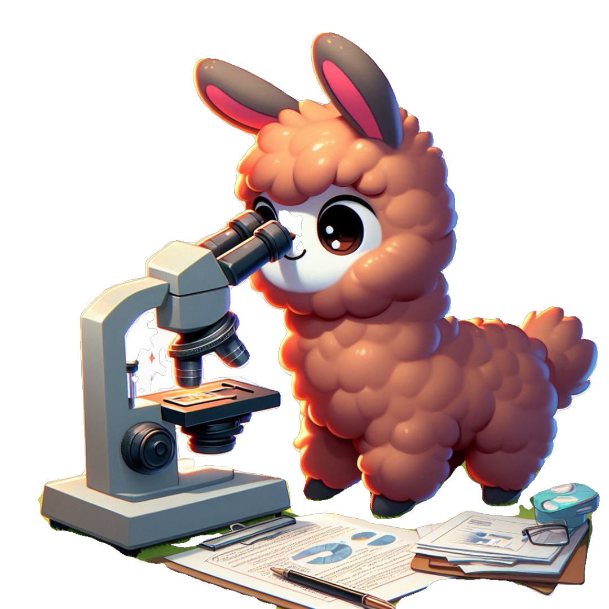

# 👁️👁️ VARAG 
Vision Augmented Retrieval and Generation


| | VARAG (Vision-Augmented Retrieval and Generation) is a vision-first RAG engine that emphasizes vision-based retrieval techniques. It enhances traditional Retrieval-Augmented Generation (RAG) systems by integrating both visual and textual data through Vision-Language models. |
|:--:|:--|

[](https://github.com/adithya-s-k/VARAG/stargazers)
[](https://github.com/adithya-s-k/VARAG/network/members)
[](https://github.com/adithya-s-k/VARAG/issues)
[](https://github.com/adithya-s-k/VARAG/pulls)
[](https://github.com/adithya-s-k/VARAG/blob/main/LICENSE)

## 🌟 Key Features

VARAG offers a comprehensive set of features designed for vision-augmented document retrieval and generation:

### 🔍 **Multiple Retrieval Strategies**
- **Simple RAG**: Text extraction with OCR using Docling
- **Vision RAG**: Cross-modal retrieval with JinaCLIP embeddings
- **ColPali RAG**: Direct document page embeddings with late interaction
- **Hybrid ColPali RAG**: Combined image embeddings and ColPali re-ranking

### 🤖 **Multi-Provider LLM/VLM Support**
- **OpenAI Integration**: Support for GPT-4o, GPT-4o-mini and other vision models
- **LiteLLM Provider**: Unified interface for 100+ LLM providers including:
  - Anthropic Claude
  - Google Gemini
  - Groq
  - And many more through LiteLLM

### 📊 **Advanced Interpretability**
- **ColPali Similarity Maps**: Visual heatmaps showing attention patterns
- **Token-level Analysis**: Understand model focus on document regions
- **Comparative Analysis**: Compare different ColPali model performances
- **Interactive Visualizations**: Explore retrieval results with similarity overlays

### 🔧 **Flexible Architecture**
- **Modular Design**: Mix and match components easily
- **LanceDB Integration**: High-performance vector storage
- **Custom Chunking**: Configurable text splitting strategies
- **Environment Management**: Support for multiple Python environments

### 🎯 **Interactive Demo**
- **Gradio Interface**: Web-based demo for testing different RAG approaches
- **Real-time Comparison**: Side-by-side evaluation of retrieval techniques
- **Progress Tracking**: Monitor ingestion and retrieval progress
- **API Key Management**: Secure handling of different provider credentials


### Supported Retrieval Techniques

VARAG supports a wide range of retrieval techniques, optimized for different use cases, including text, image, and multimodal document retrieval. Below are the primary techniques supported:

<details> <summary>Simple RAG (with OCR)</summary>
Simple RAG (Retrieval-Augmented Generation) is an efficient and straightforward approach to extracting text from documents and feeding it into a retrieval pipeline. VARAG incorporates Optical Character Recognition (OCR) through Docling, making it possible to process and index scanned PDFs or images. After the text is extracted and indexed, queries can be matched to relevant passages in the document, providing a strong foundation for generating responses that are grounded in the extracted information. This technique is ideal for text-heavy documents like scanned books, contracts, and research papers, and can be paired with Large Language Models (LLMs) to produce contextually aware outputs.

</details> <details> <summary>Vision RAG</summary>
Vision RAG extends traditional RAG techniques by incorporating the retrieval of visual information, bridging the gap between text and images. Using a powerful cross-modal embedding model like JinaCLIP (a variant of CLIP developed by Jina AI), both text and images are encoded into a shared vector space. This allows for similarity searches across different modalities, meaning that images can be queried alongside text. Vision RAG is particularly useful for document analysis tasks where visual components (e.g., figures, diagrams, images) are as important as the textual content. It’s also effective for tasks like image captioning or generating product descriptions where understanding and correlating text with visual elements is critical.

</details> <details> <summary>ColPali RAG</summary>
ColPali RAG represents a cutting-edge approach that simplifies the traditional retrieval pipeline by directly embedding document pages as images rather than converting them into text. This method leverages PaliGemma, a Vision Language Model (VLM) from the Google Zürich team, which encodes entire document pages into vector embeddings, treating the page layout and visual elements as part of the retrieval process. Using a late interaction mechanism inspired by ColBERT (Column BERT), ColPali RAG enhances retrieval by enabling token-level matching between user queries and document patches. This approach ensures high retrieval accuracy while also maintaining reasonable indexing and querying speeds. It is particularly beneficial for documents rich in visuals, such as infographics, tables, and complex layouts, where conventional text-based retrieval methods struggle.

</details> <details> <summary>Hybrid ColPali RAG</summary>
Hybrid ColPali RAG further enhances retrieval performance by combining the strengths of both image embeddings and ColPali’s late interaction mechanism. In this approach, the system first performs a coarse retrieval step using image embeddings (e.g., from a model like JinaCLIP) to retrieve the top-k relevant document pages. Then, in a second pass, the system re-ranks these k pages using the ColPali late interaction mechanism to identify the final set of most relevant pages based on both visual and textual information. This hybrid approach is particularly useful when documents contain a mixture of complex visuals and detailed text, allowing the system to leverage both content types for highly accurate document retrieval.

</details>

## 🏗️ Architecture Overview

VARAG follows a modular architecture that separates concerns and enables easy experimentation:

```
VARAG/
├── varag/
│   ├── rag/           # Core RAG implementations
│   ├── llms/          # Language model providers
│   ├── vlms/          # Vision-language model providers
│   ├── models/        # Model utilities and configurations
│   ├── chunking/      # Text chunking strategies
│   └── utils.py       # Utility functions and similarity mapping
├── examples/          # Usage examples and demos
│   ├── base_implementation/  # Base embedding implementations
│   └── inference_colpali/   # ColPali interpretation tools
├── docs/             # Documentation and notebooks
└── demo.py          # Interactive Gradio demo
```

---


## 🚀 Getting Started with VARAG

Follow these steps to set up VARAG:

### 1. Clone the Repository

```bash
git clone https://github.com/adithya-s-k/VARAG
cd VARAG
```

### 2. Set Up Environment

Create and activate a virtual environment using Conda:

```bash
conda create -n varag-venv python=3.10
conda activate varag-venv
```

### 3. Install Dependencies

Install the required packages using pip:

```bash
pip install -e .

# or 

poetry install
```

To install OCR dependencies:

```bash
pip install -e .["ocr"]
```
### 4. Set Up API Keys

Create a `.env` file in the project root:

```bash
# For OpenAI
OPENAI_API_KEY="your-openai-api-key"

# For Google Gemini (via LiteLLM)
GEMINI_API_KEY="your-gemini-api-key"
```

---
 
### Try Out VARAG

Explore VARAG with our interactive playground! It lets you seamlessly compare various RAG (Retrieval-Augmented Generation) solutions, from data ingestion to retrieval.

[](https://colab.research.google.com/github/adithya-s-k/VARAG/blob/main/docs/demo.ipynb)

You can run it locally or on Google Colab:
```bash
python demo.py --share
``` 

This makes it easy to test and experiment with different approaches in real-time.

---


### How VARAG is structured

Each RAG technique is structured as a class, abstracting all components and offering the following methods:

```python
from varag.rag import {{RAGTechnique}}

ragTechnique = RAGTechnique()

ragTechnique.index(
  "/path_to_data_source",
  other_relevant_data
)

results = ragTechnique.search("query", top_k=5)

# These results can be passed into the LLM / VLM of your choice
```


#### Why Abstract So Much?

I initially set out to rapidly test and evaluate different Vision-based RAG (Retrieval-Augmented Generation) systems to determine which one best fits my use case. I wasn’t aiming to create a framework or library, but it naturally evolved into one. 

The abstraction is designed to simplify the process of experimenting with different RAG paradigms without complicating compatibility between components. To keep things straightforward, LanceDB was chosen as the vector store due to its ease of use and high customizability.

This paradigm is inspired by the [Byaldi](https://github.com/AnswerDotAI/byaldi) repo by Answer.ai.

---
### ColPali Similarity Analysis

```python
from varag.utils import create_similarity_mapper, analyze_multiple_images

# Create similarity mapper
similarity_mapper = create_similarity_mapper(colpali_model, colpali_processor)

# Analyze single image
result = similarity_mapper.analyze_image_with_query(
    image_path, 
    "What are the key findings?"
)

# Analyze multiple images
results = analyze_multiple_images(
    similarity_mapper,
    [image1, image2, image3],
    "Compare the results across these documents"
)
```

### ColPali Interpretability Tools
Advanced analysis tools in `examples/inference_colpali/`:
- **Similarity Heatmaps**: Visual attention maps for query-document matching
- **Model Comparison**: Compare different ColPali model versions
- **Token-level Analysis**: Understand fine-grained model behavior

### Techniques and Notebooks

| **Technique**        | **Notebook**                                                                                                                                                                        | **Demo**                                                                                                                   |
|----------------------|------------------------------------------------------------------------------------------------------------------------------------------------------------------------------------|----------------------------------------------------------------------------------------------------------------------------|
| **Simple RAG**        | [](https://colab.research.google.com/github/adithya-s-k/VARAG/blob/main/docs/simpleRAG.ipynb)            | [simpleRAG.py](https://github.com/adithya-s-k/VARAG/blob/main/examples/textDemo.py)                                                                                       |
| **Vision RAG**        | [](https://colab.research.google.com/github/adithya-s-k/VARAG/blob/main/docs/visionRAG.ipynb)            | [visionDemo.py](https://github.com/adithya-s-k/VARAG/blob/main/examples/visionDemo.py)                                                                                   |
| **Colpali RAG**       | [](https://colab.research.google.com/github/adithya-s-k/VARAG/blob/main/docs/colpaliRAG.ipynb)            | [colpaliDemo.py](https://github.com/adithya-s-k/VARAG/blob/main/examples/colpaliDemo.py)                                                                                  |
| **Hybrid Colpali RAG**| [](https://colab.research.google.com/github/adithya-s-k/VARAG/blob/main/docs/hybridColpaliRAG.ipynb)     | [hybridColpaliDemo.py](https://github.com/adithya-s-k/VARAG/blob/main/examples/hybridColpaliDemo.py)                                                                      |

---

### Explanation:

- **Technique**: This column lists the different techniques implemented for Retrieval-Augmented Generation (RAG).
- **Notebook**: Colab links with the "Open In Colab" button for interactive exploration of each technique.
- **Demo**: Links to the corresponding demo scripts in the repository that can be executed locally.


## 🛠️ Contributing

Contributions to VARAG are highly encouraged! Whether it's code improvements, bug fixes, or feature enhancements, feel free to contribute to the project repository. Please adhere to the contribution guidelines outlined in the repository for smooth collaboration.

---

## 📜 License

VARAG is licensed under the [MIT License](https://opensource.org/licenses/MIT), granting you the freedom to use, modify, and distribute the code in accordance with the terms of the license.


##  Acknowledgments

We extend our sincere appreciation to the following projects and their developers:

- **Docling** - For PDF text extraction (OCR) and text extraction.
- **LanceDB** - For vector database functionality.

This project also draws inspiration from the following repositories:

- [Byaldi](https://github.com/AnswerDotAI/byaldi)
- [RAGatouille](https://github.com/AnswerDotAI/RAGatouille)

For the implementation of **Colpali**, we referred to the following blogs and codebases:

- [Vision Retrieval by Kyryl](https://github.com/kyryl-opens-ml/vision-retrieval)
- [Vision Retrieval by AyushExel](https://github.com/AyushExel/vision-retrieval)
- [The Rise of Vision-Driven Document Retrieval for RAG](https://blog.vespa.ai/the-rise-of-vision-driven-document-retrieval-for-rag/)

We would also like to acknowledge the authors of the ColPali paper, which significantly influenced our work:

```
@misc{faysse2024colpaliefficientdocumentretrieval,
      title={ColPali: Efficient Document Retrieval with Vision Language Models}, 
      author={Manuel Faysse and Hugues Sibille and Tony Wu and Bilel Omrani and Gautier Viaud and Céline Hudelot and Pierre Colombo},
      year={2024},
      eprint={2407.01449},
      archivePrefix={arXiv},
      primaryClass={cs.IR},
      url={https://arxiv.org/abs/2407.01449}, 
}
```